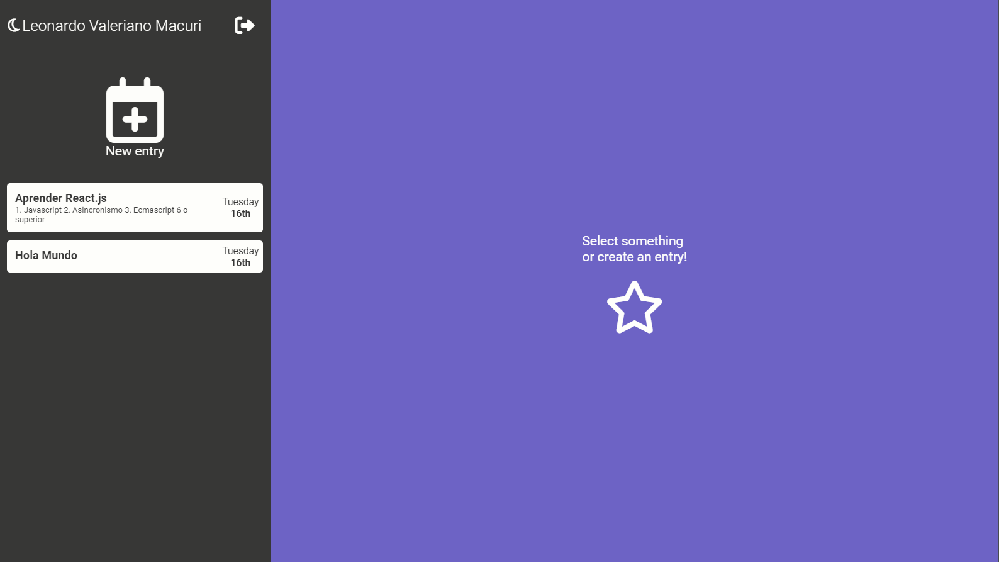
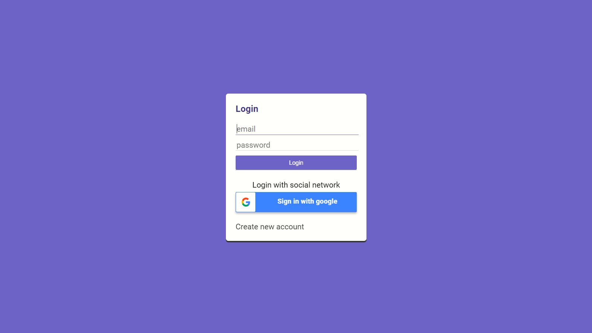

# Journal App

This project was created with [Create React App](https://github.com/facebook/create-react-app).

## About

Application to create, save, modify and delete notes, where you can also upload images, to access it you have to login, either with an email or with a gmail account. This application was made with React, Javascript, Redux (for state management), Firebase (for authentication), Cloudinary (for uploading images).

## Results

